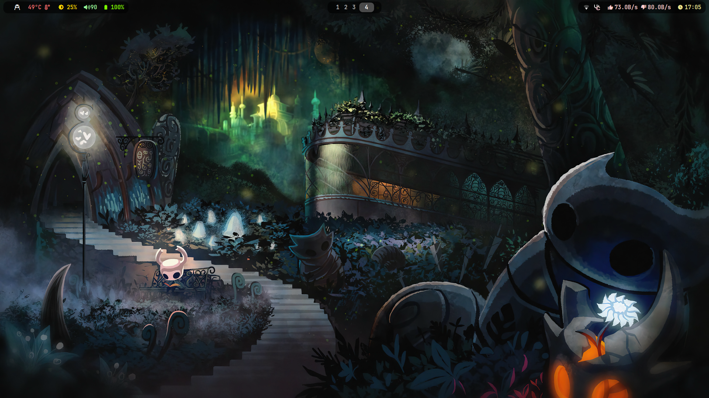
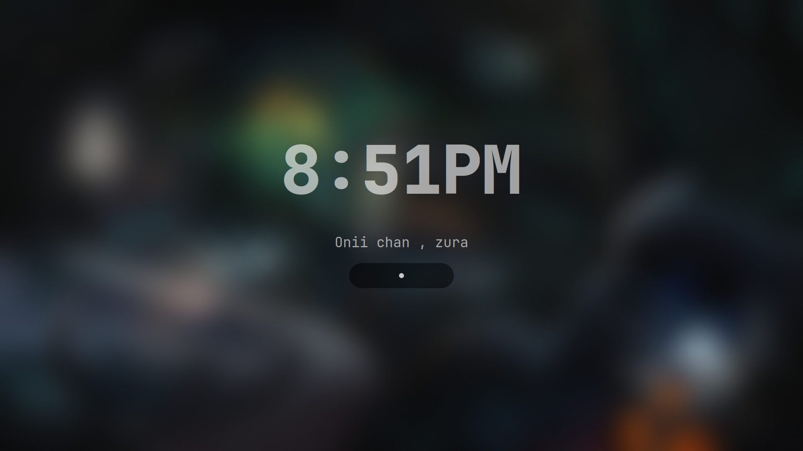
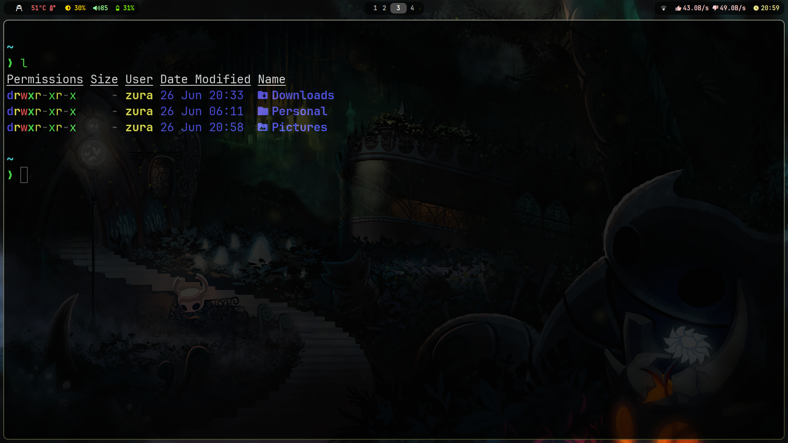
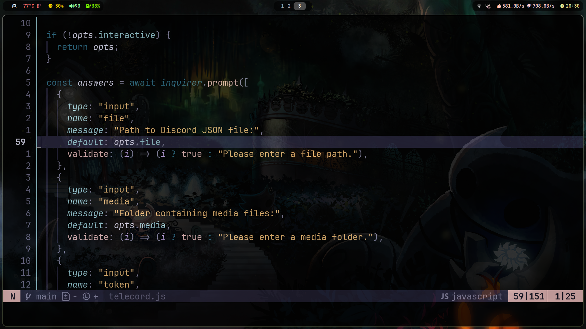
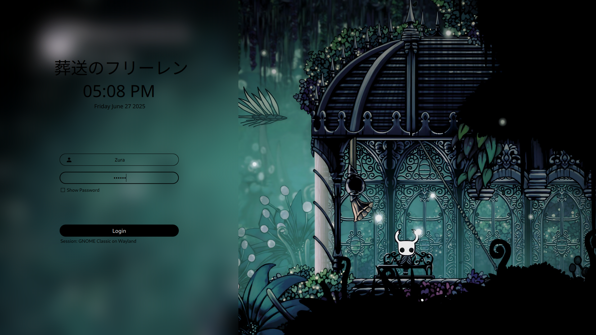
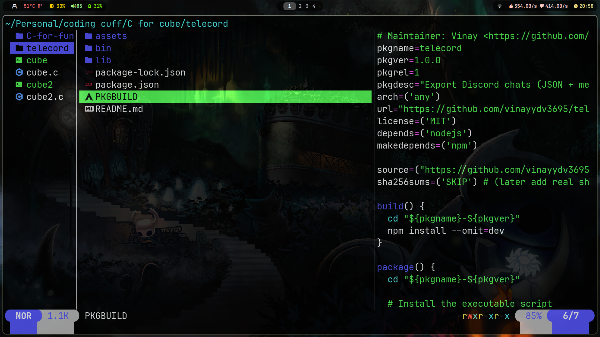
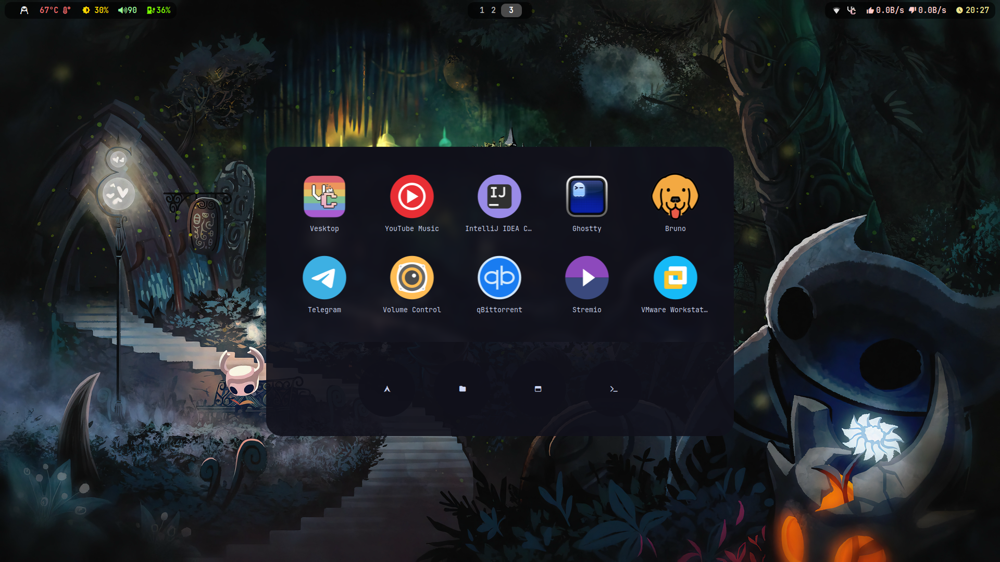
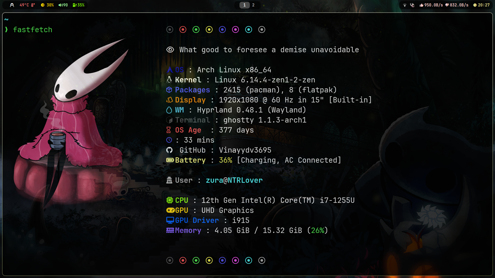

# HollowDots

> _"No cost too great..."_

A clean and minimal Hyprland configuration tailored for power users who value **performance**, **aesthetic**, and **workflow efficiency**.



---

## ✨ Features

- **Hyprland**: Dynamic tiling + smooth animations
- **Theming**: Light/dark toggle, consistent aesthetics across apps
- **Terminals**: Ghostty (primary) and Kitty (fallback)
- **Browser**: Brave with built-in dark mode
- **File Managers**: Yazi (TUI) + Dolphin (GUI)
- **Editor**: Neovim preconfigured with LSP, tree view, and themes
- **Launcher**: Rofi with a theme-matched UI
- **System Monitor**: Fastfetch with custom icons and color scheme
- **Lock Screen**: Hyprlock with custom blur and time
- **Font Setup**: Nerd Fonts patched, ideal for Dev + UI

---

## 📸 Screenshots

### 🔒 Lock Screen



- Real-time blur
- Time/date overlay
- Minimal user greeting

### 🖥️ Terminal Workflow



- Powerline-style prompt
- Git branch display
- Clean ls colors

### 🧠 Code Editing



- Syntax highlighting
- Autocomplete with LSP
- File tree navigation

Here’s a 4-line section you can add for showcasing your **SDDM theme** under the screenshots section:

---

### 🖼️ Login Display (SDDM)



- Custom theme with blur and dark mode
- Time + user display matching Hyprland aesthetics

---

### 🗂 File Management



- File previews
- Image + video support
- Fast PKGBUILD inspection

### 🚀 App Launcher



- Fuzzy search
- Category icons
- Light/dark aware

### 📊 System Info



- GPU/CPU/RAM usage
- Battery + uptime
- Custom icons + branding

---

## 🛠️ Installation

### 1. Clone Repository

```bash
git clone https://github.com/vinayydv3695/HollowDots ~/.config/HollowDots
```

### 2. Install Dependencies

```bash
cd ~/.config/HollowDots
./install.sh
```

### 3. Post-Install Configuration

```bash
fc-cache -fv  # Refresh font cache
systemctl --user enable xdg-desktop-portal-hyprland
```

---

## ⌨️ Keybinds (Super = Win key)

| Keybind       | Action                |
| ------------- | --------------------- |
| Super + Enter | Open Ghostty Terminal |
| Super + D     | Launch Rofi           |
| Super + E     | Open Dolphin          |
| Super + Y     | Launch Yazi           |
| Super + P     | Take a Screenshot     |
| Super + L     | Lock the Screen       |

🔎 Full list in `~/.config/hypr/hyprland.conf`

---

## ⚙️ Customization

### Update Configs

```bash
./update.sh
```

### Uninstall

```bash
./uninstall.sh
```

---

## ❓ FAQ

> **Q:** How do I change the wallpaper?

````bash
swww img  < path of your wallpaper >```

> **Q:** Waybar not displaying?
```bash
pkill waybar && waybar
````

> **Q:** How to reset all configs?

```bash
rm -rf ~/.config/HollowDots && git clone https://github.com/vinayydv3695/HollowDots ~/.config/HollowDots
```

---

## 📜 License

MIT License — free to use, modify, and distribute.

---

## ⭐ Credits

- Inspired by [Hyprdots](https://github.com/prasanthrangan/hyprdots)
- Built with ❤️ by [Vinay](https://github.com/vinayydv3695)
- Thanks to the **Arch Linux** and **Hyprland** communities

> Star the repo if you find it useful!
