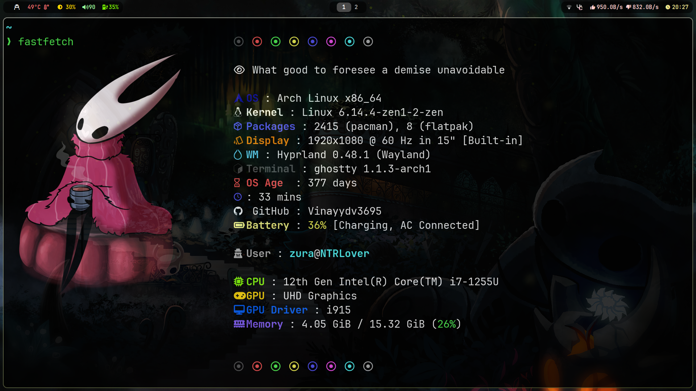
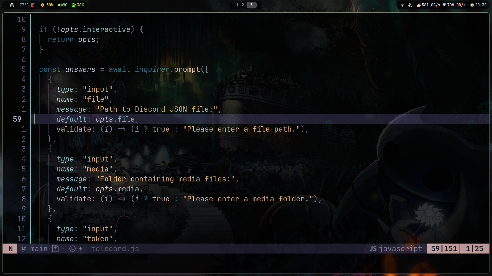
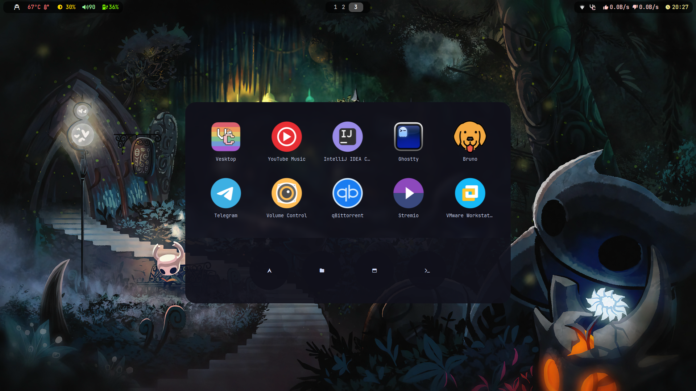
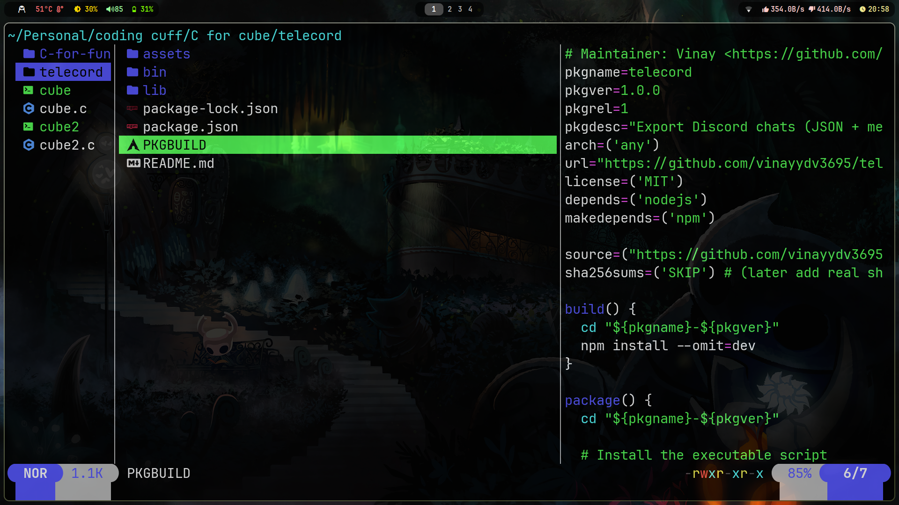
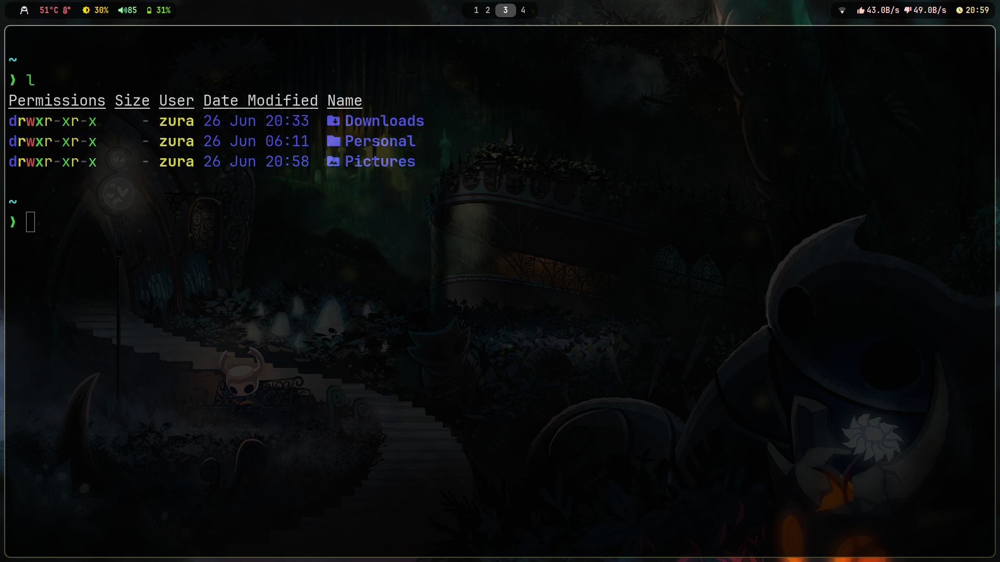
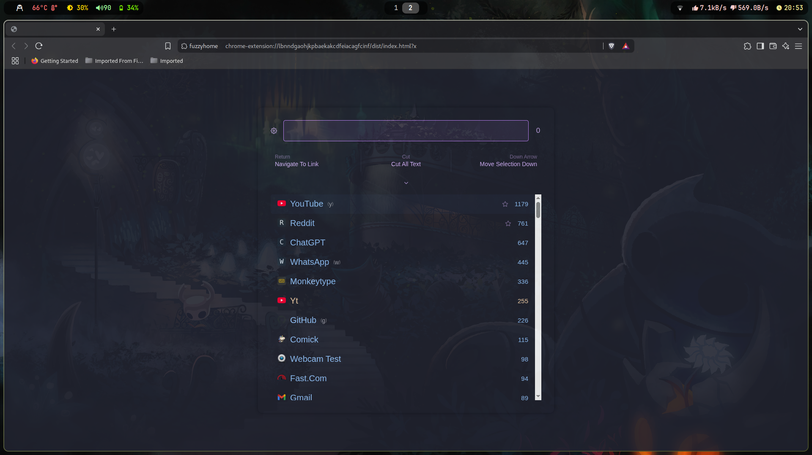
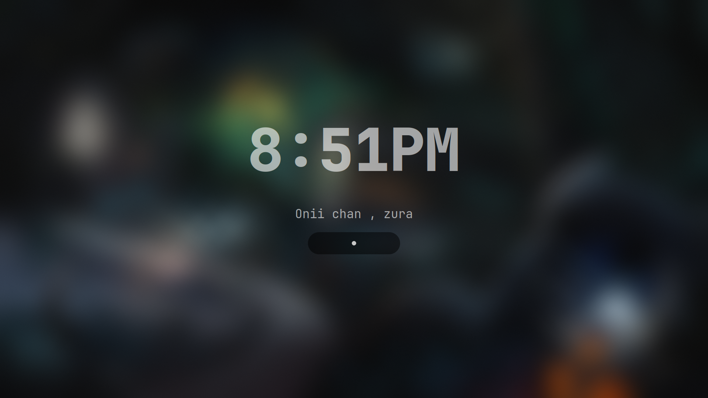
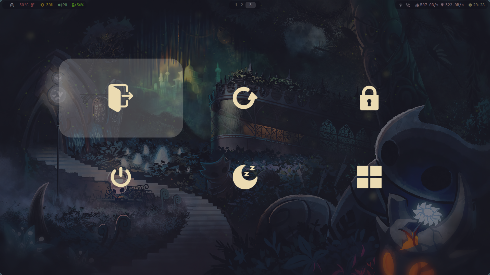

# HollowDots

These are my personal dotfiles for Hyprland on Arch Linux. They are designed to be a complete and easy-to-use setup that is both beautiful and efficient.

---

## Screenshots

---

Here is a gallery of my desktop setup:

|                                                  |                                                           |
| :----------------------------------------------: | :-------------------------------------------------------: |
|                 **Main Desktop**                 |                       **Fastfetch**                       |
|             |                    |
|                    **Neovim**                    |                         **Rofi**                          |
|                 |                              |
|              **Yazi File Manager**               |                   **Ghostty Terminal**                    |
|        |               |
|                **Brave Browser**                 |                 **Hyprland Lock Screen**                  |
|    |  |
|                **Logout Options**                |                  **SDDM Login Manager**                   |
|  |                |

## ✨ Features

- **A Beautiful and Consistent Design:** The entire setup is designed to be visually appealing and consistent, with a custom theme for all applications.
- **Efficient Workflow:** The keybindings and scripts are designed to be as efficient as possible, allowing you to get your work done faster.
- **Easy to Customize:** The dotfiles are designed to be easy to customize. You can change the theme, keybindings, and other settings to your liking.

## 🚀 Ansible for Automation

This repository uses Ansible to automate the setup and management of the dotfiles on Arch Linux.

### Prerequisites

1.  **Install Ansible:** Follow the official Ansible installation guide for your distribution. For Arch Linux, you can use:
    ```bash
    sudo pacman -S ansible
    ```
2.  **Clone the repository:**
    ```bash
    git clone https://github.com/Vinayydv3695/HollowDots.git
    cd HollowDots
    ```

### Playbooks

The following playbooks are available in the `playbooks/` directory:

- **`main.yml`**: This is the main playbook that sets up the entire system. It installs all the necessary packages, copies the dotfiles, and configures the system settings.
- **`update.yml`**: This playbook updates the system packages.
- **`deploy.yml`**: This playbook deploys the dotfiles to the local machine.
- **`ssh-setup.yml`**: This playbook helps in setting up SSH keys for secure remote management.

### Usage

To run a playbook, use the `ansible-playbook` command. For example, to run the main setup playbook:

```bash
ansible-playbook playbooks/main.yml --ask-become-pass
```

## Customization

To customize the dotfiles, you can create user-specific configuration files in the `~/.config` directory.

- **Hyprland:** Create a `~/.config/hypr/userprefs.conf` file to add your own Hyprland settings.
- **Kitty:** Create a `~/.config/kitty/userprefs.conf` file to add your own Kitty settings.
